# Self-Hosted Deployment Platform

A reusable self-hosted infrastructure for deploying and managing multiple containerized applications on a Linux VPS.

I've built this repo to document the architecture, deployment workflows, and engineering decisions behind my personal DevOps environment. Instead of configuring each application independently, I built a standardized deployment platform that supports multiple projects, automated deployments, reverse proxy routing, HTTPS, and isolated application environments.

> **For this repository, I've intentionally added sanitized examples and documentation rather than the production infrastructure itself.** Some configuration files have been generalized to show the architecture and deployment practices without exposing sensitive information.

---

## Overview

I designed the platform around a simple objective:

> **Deploy new applications consistently with minimal manual configuration while keeping each project isolated, maintainable, and easy to update.**

Today the server hosts multiple independent web applications using a shared deployment strategy based on:

- Docker containers
- Docker Compose
- Ubuntu Linux
- GitHub Actions
- SSH
- Nginx
- Nginx Proxy Manager
- Let's Encrypt
- DigitalOcean
- DNS configurations

---

## Features

- Multi-application deployment platform
- Containerized applications with Docker
- Automated deployments using GitHub Actions
- Reverse proxy routing
- Automatic HTTPS certificate management
- Shared Docker networking
- Persistent Docker volumes
- Isolated Linux users for each project
- Standardized project structure
- Manual and automated deployment workflows

---

## Infrastructure



---

## Technology Stack

| Category | Technologies |
|-----------|--------------|
| Operating System | Ubuntu 22.04 LTS |
| Cloud | DigitalOcean |
| Containerization | Docker, Docker Compose |
| Reverse Proxy | Nginx Proxy Manager |
| Application Server | Gunicorn |
| Web Server | Nginx |
| Automation | GitHub Actions |
| Secure Access | SSH |
| SSL | Let's Encrypt |

---

## Deployment Workflow

Applications usually follow a repeatable deployment pipeline.



Not every project requires CI/CD or migrations. Smaller or infrequently updated applications may be maintained manually through SSH while I still follow the same containerized deployment strategy.

---

## Project Organization

All my applications are maintained as an independent deployment unit.

```
portfolio/
    Dockerfile
    docker-compose.yml
    nginx.conf

book_tracker/
    Dockerfile
    docker-compose.yml
    nginx.conf

tailwind_portfolio/
    Dockerfile
    docker-compose.yml
    nginx.conf
```

Projects are separated into dedicated Linux users to simplify permissions, isolate application files, and reduce coupling between deployments.

---

## Docker Architecture

Each application follows the same deployment pattern.



I have standardized this structure to make adding new projects simpler while keeping deployments consistent.

---

## Networking

Applications communicate through a shared external Docker network.

```
hubstation
```

Using a shared network helps the reverse proxy communicate with individual application containers while keeping each application's internal configuration self-contained.

---

## Security Considerations

The production environment includes several security practices:

- SSH key authentication
- GitHub Secrets for deployment credentials
- Environment variables for application secrets
- HTTPS using Let's Encrypt
- Dedicated Linux users
- Docker container isolation
- Reverse proxy routing
- Sensitive configuration excluded from version control

As mentioned above, only sanitized examples are included in this repository.

---

## Example Configuration

This repository includes simplified examples of:

- Dockerfiles
- Docker Compose configurations
- GitHub Actions workflows
- Nginx configuration
- Environment variable templates

I try to show examples that gives us a glimpse into the deployment strategy while omitting production-specific information.

---

## Lessons Learned

Building and maintaining this platform has given me practical experience with:

- Linux server administration
- Container orchestration
- Reverse proxy configuration
- Automated deployments
- CI/CD workflows
- Docker networking
- Persistent storage
- Deployment standardization
- Infrastructure troubleshooting
- Operating multiple applications from a single VPS

---

## Repository Structure

```
homelab-devops/
│
├── docs/
├── diagrams/
├── examples/
├── screenshots/
└── README.md
```

---

## Future Improvements

Planned enhancements include:

- Multi-stage Docker builds
- Automated backups
- Health monitoring
- Infrastructure as Code
- Zero-downtime deployments
- Container health checks
- Cloudfare DNS managing

---

## License

This project is provided for educational and portfolio purposes.
